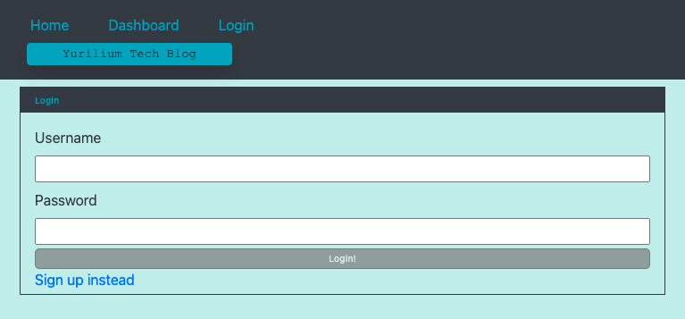

# Yurillium Tech Blog

## Description
This is a tech blog site for the developers to post and read technology related articles, and post comments to them! 
Go to [Yurillium Tech Blog](https://quiet-headland-91755.herokuapp.com/) now!

## Table of Contents
- [Usage](#usage)
- [License](#license)
- [Questions](#questions)

## Usage
1. The blog will show articles posted by all website's user in the homepage.
2. When clicked on a single article, it will lead you to its page and view its comments.

3. In order to add comments to the article, post an article, or view your posted articles, you will need to sign up and login.
4. Click on login button in the nav bar to login. Enter credentials and click login button.

5. Click on 'Sign up instead' to sign up in login page. Enter credentials and click sign up. Your credentials will be saved and you will be logged in.

6. Click add post in your dashboard, enter title & content, and click 'Create' button.

7. Your posted articles will appear in your dashboard and you will be able to edit it and delete it.

8. To add comment to an article, click on the article in the homepage and complete the form in the bottom of the page.

9. To logout, click on logout button which will appear in the nav bar after you login. The page will automatically log you out after 30 minutes from login.

## License
Licensed under the [MIT License](https://opensource.org/licenses/MIT).
      
## Questions
- GitHub Profile: https://github.com/YuriI92
- If you have any additional questions, please feel free to contact me by email.
  E-mail Address: <yurichikawa1992@gmail.com>
      
  